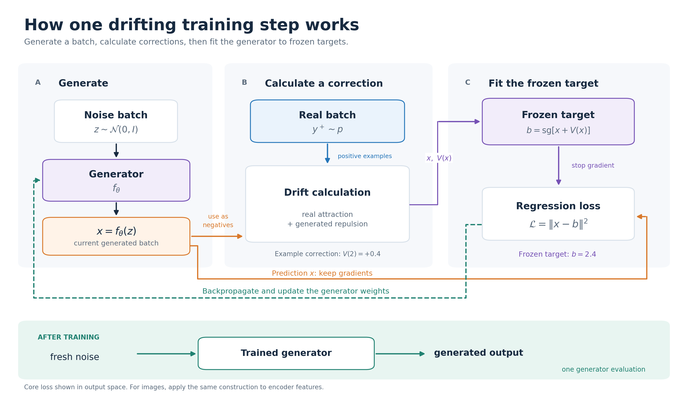
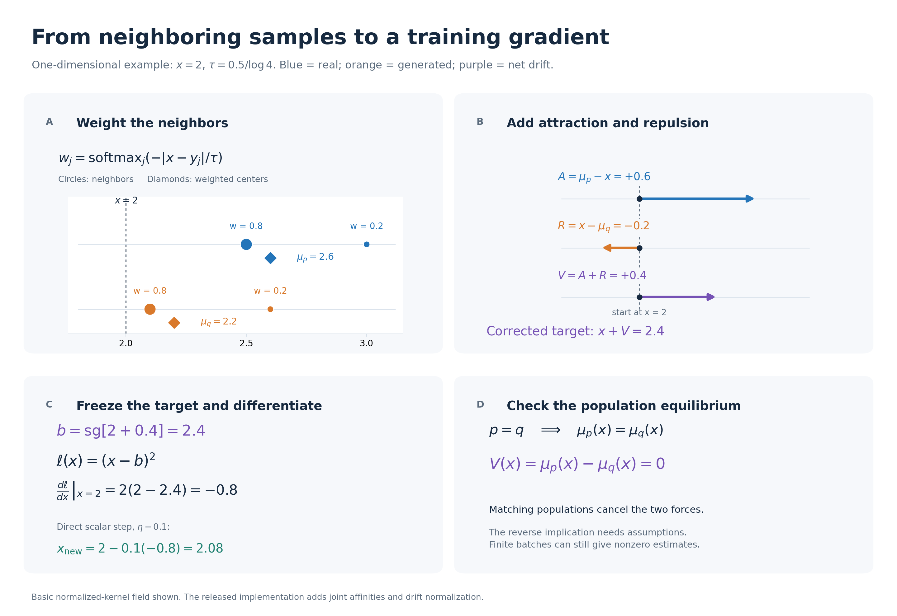
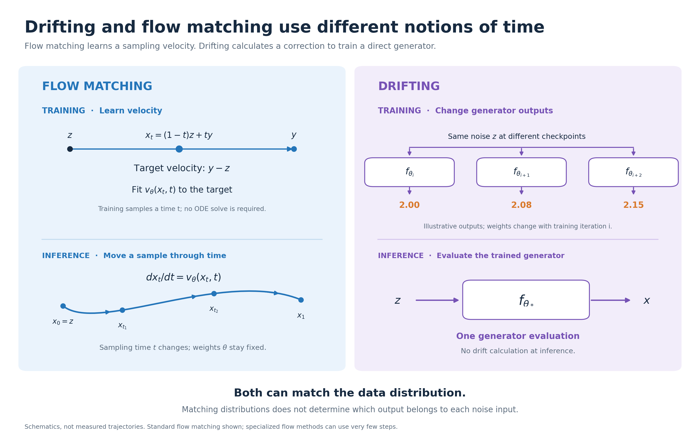

# Understanding Drifting Models from Training to Flow Matching

> **Note:** This post was generated by ChatGPT based on an in-depth discussion I had with it.

Drifting models train a generator by repeatedly correcting the samples it produces. Each training step uses real and generated examples to calculate a direction of movement, then trains the generator toward the corrected outputs. After training, the generator produces a sample in one forward pass.

The key question is how these sample-level corrections encourage the entire generated distribution to match the data. We will build up that idea from the training loop, examine its mathematics, and compare it with flow matching.

## 1 How a drifting model is trained

The central idea is: **generate some samples, calculate a correction for each sample, and train the generator to produce the corrected versions.** Repeat this throughout training. After training, generation takes one generator forward pass. [Project overview](https://lambertae.github.io/projects/drifting/)

Let’s work through what this correction means and where the training target comes from.

Start with a generator that directly turns noise into a sample:

$$
z\sim\mathcal N(0,I),
\qquad
x=f_\theta(z).
$$

Imagine generating thousands of outputs. Their distribution is called \(q_\theta\); the real-data distribution is \(p\). The goal is to make these distributions match.

“Pushforward distribution” simply means the distribution of outputs obtained by passing random noise through the generator.

### Think of real and generated samples as dots

Imagine that real examples form two clusters along a feature axis: one for small dogs and another for large dogs. Your generator currently produces mostly medium-sized dogs.

For each generated sample, the method calculates two influences:

- **Attraction:** nearby real examples pull it toward their local weighted center.
- **Repulsion:** nearby generated examples push it away from their local weighted center.

These combine into a correction vector called the drifting field, \(V(x)\). The basic construction uses distance-weighted averages. [Paper, Section 3.3](https://arxiv.org/html/2602.04770v2#S3.SS3)

Repulsion makes the correction sensitive to what the generator already produces. Realism alone is insufficient: repeatedly producing the same realistic dog would still give poor diversity.

*Figure 1. The basic training loop. The orange branch keeps the gradient through the generated prediction; the target branch is frozen. The green dashed arrow represents the parameter update. At inference, the trained generator directly produces an output. For image training, the same loss can operate on encoder features.*

### Follow one training iteration

**1. Generate a batch.**

Draw noise vectors and run the current generator:

$$
x_1=f_\theta(z_1),\ldots,x_N=f_\theta(z_N).
$$

Also sample real examples \(y_1,\ldots,y_M\).

**2. Calculate a correction for each generated sample.**

For a generated point \(x_i\), define two local, weighted centers:

$$
\mu_{\mathrm{real}}(x_i)
=
\frac{\sum_{j=1}^{M}k(x_i,y_j)y_j}
{\sum_{j=1}^{M}k(x_i,y_j)},
$$

$$
\mu_{\mathrm{generated}}(x_i)
=
\frac{\sum_{j\ne i}k(x_i,x_j)x_j}
{\sum_{j\ne i}k(x_i,x_j)}.
$$

The generated center excludes \(x_i\) itself and requires at least one other generated example. Nearby points receive larger weights:

$$
k(x,y)=\exp\!\left(-\frac{\|x-y\|_2}{\tau}\right).
$$

The temperature \(\tau>0\) controls how local these interactions are. We will examine this weighting more closely in Section 2.

The basic drift is

$$
\boxed{
\begin{aligned}
V(x_i)
&=
\underbrace{\big(\mu_{\mathrm{real}}(x_i)-x_i\big)}
_{\text{pull toward real examples}}
\\
&\quad+
\underbrace{\big(x_i-\mu_{\mathrm{generated}}(x_i)\big)}
_{\text{push away from generated neighbors}}.
\end{aligned}
}
$$

Equivalently,

$$
V(x_i)=\mu_{\mathrm{real}}(x_i)-\mu_{\mathrm{generated}}(x_i).
$$

These are minibatch versions of the basic attraction–repulsion field. The released implementation adds normalization and weighting details; we return to those in Section 2.

**3. Create a temporary training target.**

$$
\boxed{
x_i^{\mathrm{target}}
=\operatorname{stopgrad}\big[x_i+V(x_i)\big]
}
$$

This target says:

> For this noise input, your current output is here. Try producing something in this direction.

There is no predefined pairing between a noise vector and a particular real image. The target is constructed from the current output and the two sample populations.

**4. Fit the generator to that target.**

$$
\boxed{
\mathcal L
=
\frac1N\sum_{i=1}^{N}
\left\|
f_\theta(z_i)-x_i^{\mathrm{target}}
\right\|^2
}
$$

Backpropagation updates \(\theta\). The next iteration generates another batch and recomputes the targets. The released code detaches the target construction and computes squared error against differentiable generator outputs. [Loss implementation](https://github.com/lambertae/drifting/blob/main/drift_loss.py)

The core loop can be written as:

~~~python
z = sample_noise(batch_size)
x = generator(z)
real = sample_real_data(batch_size)

with no_grad():
    correction = compute_drift(x, real, generated=x)
    target = x + correction

loss = ((x - target) ** 2).sum(dim=-1).mean()
optimizer.zero_grad()
loss.backward()
optimizer.step()
~~~

This pseudocode illustrates the training pattern; it is not a reproduction of every implementation detail.

### Why the target is frozen

Stop-gradient holds the entire corrected target fixed during the backward pass. The loss differentiates the prediction branch, so the generator learns to follow the correction. The target is recomputed in the next training iteration.

The optimizer changes shared network weights, so it only approximately realizes the requested movements of individual outputs.

### Where the drifting happens

Imagine keeping one noise vector \(z\) fixed and inspecting different training checkpoints:

$$
f_{\theta_0}(z),\quad
f_{\theta_1}(z),\quad
f_{\theta_2}(z),\ldots
$$

Its output changes as the weights change. This is the training-time drift.

At inference, the trained weights are fixed, and we evaluate

$$
x=f_{\theta_{\mathrm{trained}}}(z)
$$

once. Generating a new output does not require calculating attraction, repulsion, or a drifting target. [Project overview](https://lambertae.github.io/projects/drifting/)

A generator that produces a compressed image representation also needs a decoder to turn that representation into an image.

### What changes for images

For images, the training system applies the drifting loss to features from a fixed, pretrained encoder. Write these features as \(h=\phi(x)\). The same training pattern becomes

$$
h^{\mathrm{target}}=\operatorname{stopgrad}[h+V(h)],
\qquad
\mathcal L_i=\|h-h^{\mathrm{target}}\|^2.
$$

The encoder's weights stay fixed, while gradients pass through its input to the generator. Think of a feature as a measurement of an image: training changes the generated image so that its measurements move toward the corrected target. The released training code combines multiple feature sets. [Training implementation](https://github.com/lambertae/drifting/blob/main/train.py)

We now know what happens in a training step. The next question is why this particular correction should encourage the generated distribution to match the real one.

## 2 The mathematics behind the correction

The training loop tells us how to use a drift. Here we examine why the weights take their form, why both populations matter, and what a zero-drift equilibrium actually guarantees.

### A kernel turns distance into a weight

For a generated point \(x\) and a neighboring point \(y\), the paper chooses

$$
k(x,y)=\exp\!\left(-\frac{\|x-y\|_2}{\tau}\right).
$$

The norm is Euclidean distance, without squaring it. The parameter \(\tau>0\) controls how quickly influence decreases with distance. This is a design choice for measuring similarity. [Paper, Equation 12](https://arxiv.org/html/2602.04770v2#S3.SS3)

For a list of neighbors \(y_1,\ldots,y_m\), normalize these positive scores:

$$
w_j(x)=
\frac{k(x,y_j)}{\sum_{\ell=1}^{m}k(x,y_\ell)}
=
\frac{\exp(-d_j/\tau)}
{\sum_{\ell=1}^{m}\exp(-d_\ell/\tau)},
\qquad d_j=\|x-y_j\|_2.
$$

The final expression is exactly a softmax over the negative distances.

Nothing extra has been learned in this softmax. Once we choose the exponential kernel and divide by its sum, softmax follows algebraically.

For example, with distances \(1,2,3\) and \(\tau=1\):

| Distance | Kernel score | Normalized weight |
| --- | ---: | ---: |
| 1 | 0.368 | 0.665 |
| 2 | 0.135 | 0.245 |
| 3 | 0.050 | 0.090 |

The closest neighbor receives the largest weight. A small temperature concentrates attention on close neighbors; a large temperature makes the weights more uniform.

### Why attraction alone is insufficient

Consider an especially simple target distribution: real samples are equally likely to be \(-1\) or \(+1\).

Suppose we use uniform weights and attract every generated point toward the real weighted center. That center is zero. The update would encourage outputs to collect around zero, even though the real data contains no zero.

This example shows the problem with “move toward real examples” as a complete objective: an average of valid examples need not have the correct distribution.

Repulsion makes the correction depend on the generated population as well. More fundamentally, when the real and generated distributions agree, their weighted centers agree at every location, so the two movements cancel.

Local weights matter too. With completely uniform weights,

$$
V(x)=\mathbb E_p[Y]-\mathbb E_q[Y].
$$

This only compares global means. A distribution concentrated at zero and a distribution split equally between \(-1\) and \(+1\) would look identical to it.

Distance-dependent weighting lets different locations inspect different neighborhoods. It provides more information than a single mean comparison.

### From batches to distributions

The weighted center of a whole distribution is

$$
\mu_p(x)=
\frac{\mathbb E_{Y\sim p}[k(x,Y)Y]}
{\mathbb E_{Y\sim p}[k(x,Y)]}.
$$

Read an expectation as a population average. The denominator turns the kernel scores into normalized weights. Replacing expectations with batch averages gives the calculations above.

The basic population drift is therefore

$$
V_{p,q}(x)=\mu_p(x)-\mu_q(x).
$$

This also explains why no explicit formula for the data density is required: the batch version only needs samples and distances.

### A numerical example makes stop-gradient clearer

*Figure 2. A complete numerical example of the basic field. A: normalize the distance-based kernel within each neighbor set. B: add attraction and repulsion. C: freeze the target and differentiate the regression loss; the illustrated scalar update is not an exact neural-network update. D: matching population distributions give zero drift. The full implementation adds the normalization details discussed below.*

Consider a one-dimensional example:

| Quantity | Value |
| --- | ---: |
| Current generated output \(x\) | 2.0 |
| Weighted real-data center | 2.6 |
| Weighted generated-data center | 2.2 |

Then

$$
\text{attraction}=2.6-2.0=+0.6,
$$

$$
\text{repulsion}=2.0-2.2=-0.2,
$$

$$
V=0.6-0.2=0.4.
$$

The temporary target becomes

$$
x^{\mathrm{target}}=2.0+0.4=2.4.
$$

The training instruction is now ordinary regression:

$$
\mathcal L_i=(x-2.4)^2.
$$

At \(x=2.0\),

$$
\frac{\partial\mathcal L_i}{\partial x}
=2(2.0-2.4)=-0.8.
$$

Gradient descent therefore pushes the output upward, toward \(2.4\).

**Stop-gradient means the target stays fixed while taking this derivative.** Although the target was computed using the current output, backpropagation treats it as the constant \(2.4\).

This also explains an easy mistake:

$$
\|x-\operatorname{stopgrad}(x+V(x))\|^2
$$

has the numerical value \(\|V(x)\|^2\), but replacing it with a directly differentiated \(\|V(x)\|^2\) changes the gradient.

With the detached target, the gradient of an individual, unaveraged loss is

$$
\frac{\partial\mathcal L_i}{\partial x_i}
=
2\big[x_i-(x_i+V(x_i))\big]
=
-2V(x_i).
$$

The averaged batch loss adds the usual factor \(1/N\). The target construction contributes no derivative.

The generator's parameter gradients follow by the chain rule. Because its parameters are shared across samples, an optimizer step only approximately realizes the requested movements. We update the weights; we do not overwrite each output with its target.

### How the drift reaches the generator

The example above derived the output gradient \(-2V(x_i)\). For the generator parameters, the chain rule gives

$$
\nabla_\theta\mathcal L_i
=-2J_\theta(z_i)^\top V(x_i),
\qquad
J_\theta(z_i)=\frac{\partial f_\theta(z_i)}{\partial\theta}.
$$

The Jacobian \(J_\theta\) describes how changing the weights changes an output. This explains the distinction between a desired movement in sample space and the movement actually produced by an optimizer step: the network must realize the correction through its shared parameters.

### What equilibrium guarantees

Swapping the two distributions reverses the basic field:

$$
V_{q,p}(x)=\mu_q(x)-\mu_p(x)=-V_{p,q}(x).
$$

This property is called antisymmetry. Setting \(q=p\) immediately gives

$$
V_{p,p}(x)=0.
$$

We have established one direction: correct distributions produce zero population drift.

The reverse needs more assumptions. Our uniform-weight example already provides a counterexample: different distributions with equal means have zero drift for that kernel.

The paper's Appendix C.1 gives an identifiability argument using full support, a finite basis representation, and linear independence of induced interactions. It is not an unconditional convergence proof for neural-network training. [Paper, Appendix C.1](https://arxiv.org/html/2602.04770v2#A3.SS1)

There are further practical distinctions. Finite batches have sampling noise even when their underlying distributions match. Matching distributions of encoded features also need not uniquely determine the original image distribution if the encoder discards information.

### What the full implementation adds

The released loss masks self-interactions, normalizes distances and feature scales, and combines drifts at temperatures 0.02, 0.05, and 0.2. It computes row and column softmax affinities over a combined neighbor matrix, takes their geometric mean, and balances positive and negative contributions using their opposite total affinity. Each temperature's field is normalized before aggregation. [Loss implementation](https://github.com/lambertae/drifting/blob/main/drift_loss.py)

These details matter when reproducing the model. The separate normalized averages above explain the basic field; they are not a line-for-line description of the released loss.

## 3 How drifting relates to flow matching

*Figure 3. Two notions of time. Flow matching trains on intermediate states and uses the learned velocity during sampling. Drifting changes the generator's output for a fixed noise input across training checkpoints; its trained generator is evaluated once at inference. The checkpoint values and sampling path are schematic, not experimental results. Matching output distributions does not uniquely specify noise-to-output pairs.*

### Both methods concern distributions and movement

Flow matching also uses a vector field to transform a simple distribution into a data distribution. Its network learns a velocity field along a chosen probability path. At generation time, an ordinary differential equation moves a noise sample through that learned field. [Flow Matching for Generative Modeling](https://arxiv.org/html/2210.02747v2)

A useful entry point is linear interpolation. Draw a noise point \(z\), a real point \(y\), and a time \(t\in[0,1]\):

$$
x_t=(1-t)z+ty.
$$

The velocity along this particular line is its derivative:

$$
\frac{dx_t}{dt}=y-z.
$$

For example, if \(z=-1\) and \(y=3\), then

$$
x_t=-1+4t.
$$

At \(t=0.25\), the point is zero and its target velocity is 4. At \(t=0.75\), it is 2 and the target velocity is still 4.

This leads to the familiar linear conditional flow-matching objective:

$$
\mathcal L_{\mathrm{CFM}}
=\mathbb E_{z,y,t}
\left[
\left\|v_\theta(x_t,t)-(y-z)\right\|^2
\right].
$$

This is the zero-terminal-noise linear case; flow matching also supports other probability paths. Closely related linear-path regression is central to rectified flow. [Rectified Flow](https://arxiv.org/html/2209.03003v1)

### Why random training pairs can work

The network receives \(x_t\) and \(t\). It generally cannot recover which particular pair \((z,y)\) produced that intermediate point.

This is an ordinary least-squares problem with ambiguous targets. To see its solution, let \(U\) be a random target velocity at a fixed input, and let \(a\) be the network's prediction. Then

$$
\mathbb E\|a-U\|^2
=
\|a-\mathbb E[U]\|^2
+\mathbb E\|U-\mathbb E[U]\|^2.
$$

The second term does not depend on \(a\). The best prediction is therefore the conditional mean:

$$
v^*(x,t)=\mathbb E[y-z\mid x_t=x,t].
$$

Conditional flow matching uses these sample-level targets to learn a marginal velocity field; the corresponding FM and CFM objectives have the same parameter gradients under the paper's conditions. [Flow matching, Section 3](https://arxiv.org/html/2210.02747v2#S3)

Two consequences are useful. First, the conditional training loss can remain positive even at the optimal field, because different pairs can supply different targets at the same input. Second, straight interpolation targets do not imply that every trajectory of the learned marginal field is straight.

### Keep the two notions of time separate

For flow matching, \(t\) denotes progress within a generated sample's trajectory:

$$
\frac{dx_t}{dt}=v_\theta(x_t,t),
\qquad x_0=z.
$$

During this sampling process, the trained parameters \(\theta\) stay fixed.

For drifting, \(i\) denotes progress through training:

$$
x^{(i)}=f_{\theta_i}(z).
$$

Hold one noise input \(z\) fixed and evaluate it at successive checkpoints. Its output changes because the parameters change. Drifting training uses a desired correction

$$
f_{\theta_{i+1}}(z)
\ \text{is trained toward}\
f_{\theta_i}(z)+V_{p,q_{\theta_i}}\!\left(f_{\theta_i}(z)\right).
$$

This is a target for the next model update, not an exact description of every optimizer step.

The two methods can now be compared directly:

| Question | Standard flow matching | Basic drifting model |
| --- | --- | --- |
| What does the network predict? | Velocity at a location and sampling time | A generated output from noise |
| Where does the target come from? | A chosen conditional probability path | Real and current generated neighborhoods |
| What changes during sample generation? | The sample moves through a fixed learned field | One generator evaluation produces the output |
| Is a sampling-time variable required? | Yes, in the standard formulation | No |
| Does training require simulating the full sampling trajectory? | No, for ordinary conditional flow matching | No |

Specialized flow methods can also support very few sampling steps. The distinction here is how the training objective is constructed, not an absolute claim that every flow model must be slow.

### Can they learn the same noise-to-data mapping

Yes, when the generator can represent it.

Let \(F(z)\) be the endpoint map of an ideal, deterministic flow sampler, and suppose \(F(z)\) has distribution \(p\). A direct generator satisfying \(f_\theta(z)=F(z)\) also produces \(p\), so its population drifting field vanishes.

That establishes compatibility. It does not establish that drifting training will discover that particular map.

For a simple illustration of the ambiguity, take \(z\sim\mathcal N(0,1)\). Both

$$
f_1(z)=3+2z
\qquad\text{and}\qquad
f_2(z)=3-2z
$$

produce \(\mathcal N(3,4)\). Yet the same input \(z=1\) produces 5 under the first map and 1 under the second.

Distribution matching alone cannot distinguish these pairings. This example concerns ambiguity of the drifting objective; it does not claim that both maps are trajectories of the same one-dimensional flow ODE.

A fixed, well-posed flow ODE determines its own endpoint map. To make a separate generator reproduce those exact pairs, one could add a paired teacher objective such as

$$
\mathcal L_{\mathrm{pair}}
=\mathbb E_z\|f_\theta(z)-F(z)\|^2.
$$

### Can the losses be combined

A mathematically consistent construction is to apply drifting to the final outputs of a differentiable flow sampler \(S_\theta\), while retaining the usual flow-matching objective:

$$
\mathcal L_{\mathrm{total}}
=\mathcal L_{\mathrm{CFM}}(\theta)
+\lambda\,\mathcal L_{\mathrm{drift}}(S_\theta).
$$

At an ideal exact flow solution whose endpoint distribution is \(p\), the population drift is zero. The objectives can therefore share an ideal optimum. The conditional flow loss itself need not be zero.

This connection is a deduction from the two formulations, not the drifting paper's training recipe. It requires differentiating through the sampler for the drifting update, and it does not by itself produce a one-pass generator.

The central relationship is now concrete: flow matching teaches a network a velocity field to use while generating a sample; drifting uses a calculated field to teach a network how its generated outputs should change during training.

## Sources

- Deng et al., [Generative Modeling via Drifting](https://arxiv.org/abs/2602.04770), especially Sections 3.2–3.4 and Appendices A.1, A.6, and C.1.
- [Authors' project page](https://lambertae.github.io/projects/drifting/).
- [Official drifting loss](https://github.com/lambertae/drifting/blob/main/drift_loss.py) and [training code](https://github.com/lambertae/drifting/blob/main/train.py).
- Lipman et al., [Flow Matching for Generative Modeling](https://arxiv.org/abs/2210.02747), especially Sections 3 and 4.
- Liu et al., [Flow Straight and Fast](https://arxiv.org/abs/2209.03003), for the related linear-path formulation.

